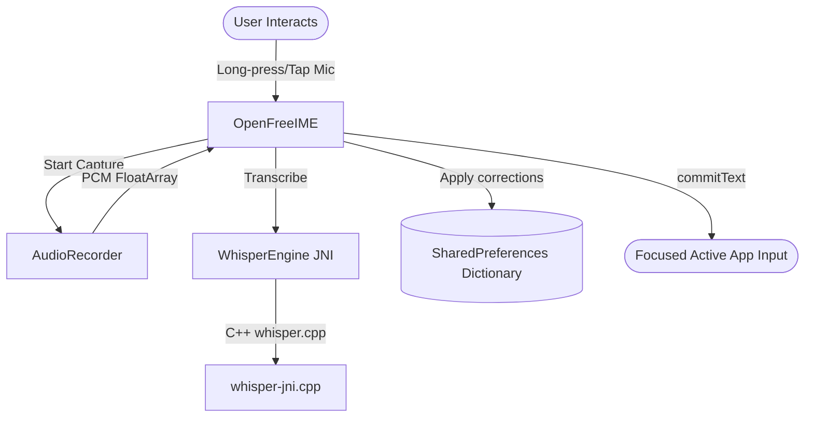

# Android 17 (API 37) Research & Codebase Analysis

This document summarizes the research on the latest Android 17 (API level 37) Cinnamon Bun platform changes and maps out how they impact the **OpenFree Voice-Dictation Keyboard** repository.

---

## 1. Android 17 Platform Features & Changes

The key architectural updates in Android 17 focus on **AI integration**, **performance**, **security**, and **large-screen compatibility**.

### A. AppFunctions (androidx.appfunctions)
*   **What it is:** Android 17 introduces AppFunctions, an on-device mechanism analogous to the Model Context Protocol (MCP). It allows applications to expose functional entry points as "tools" discoverable and executable by AI agents (e.g., Google Gemini) running on the device.
*   **Why it matters for OpenFree:** 
    *   Exposing the user's custom dictionary (e.g., adding or correcting words) via an AppFunction allows the system AI to seamlessly learn dictation corrections.
    *   Exposing dictation triggers or preference adjustments (like switching model profiles) as AppFunctions.
*   **Requirements:**
    *   Kotlin Symbol Processing (KSP) configuration.
    *   `compileSdk = 37`.
    *   Implementation of `@AppFunction`-annotated suspend methods accompanied by rich KDoc (which compiles into JSON schemas for the LLM).
    *   `res/xml/app_metadata.xml` declaration.

### B. Local Network Access Permission (`android.permission.ACCESS_LOCAL_NETWORK`)
*   **What it is:** A new runtime permission introduced in Android 17 for accessing devices on the local network.
*   **Why it matters for OpenFree:** The keyboard utilizes a remote fallback server capability (`pref_key_remote_fallback_url`). When fallback requests hit a user's home lab or local development server, the app must request and check this permission dynamically on Android 17+ devices.
*   **Current state in codebase:** Currently, `SettingsActivity.kt` checks for this permission dynamically:
    ```kotlin
    val localNetworkPermission = "android.permission.ACCESS_LOCAL_NETWORK"
    if (android.os.Build.VERSION.SDK_INT >= 37) {
        if (ContextCompat.checkSelfPermission(this, localNetworkPermission) != PackageManager.PERMISSION_GRANTED) {
            permissionsToRequest.add(localNetworkPermission)
        }
    }
    ```
    This is well-designed, but targeting `targetSdk = 37` enforces this constraint system-wide.

### C. Stricter Process Memory Limits
*   **What it is:** Android 17 enforces tighter, RAM-dependent limits on app processes to maximize device efficiency and minimize background memory pressure.
*   **Why it matters for OpenFree:** OpenFree runs a native C++ engine (`whisper.cpp`) in-process. Loading models into the native heap (ranging from 75MB to over 150MB) drastically increases memory pressure. Under Android 17, failing to release the model memory gracefully or exceeding thresholds results in OS-level termination.
*   **Requirements:** Ensure strict lifecycle management of model initialization/de-initialization and optimize the native heap footprints (e.g., load models dynamically on `onStartInputView` and unload on `onFinishInputView`).

### D. Lock-Free MessageQueue (`android.os.MessageQueue`)
*   **What it is:** Apps targeting API 37+ automatically transition to a lock-free queue model under the hood.
*   **Why it matters for OpenFree:** The keyboard heavily relies on message handling and handlers to coordinate background threads (`AudioRecorder-Thread`, `Thread` for Whisper transcription) and the Main UI Thread (`mainHandler`). The lock-free message queue reduces handler thread latency and avoids UI stutter.

### E. Mandatory Large-Screen Resizability
*   **What it is:** For apps targeting API 37, orientation locks or non-resizable layouts are ignored on devices with `sw >= 600dp` (tablets, foldables).
*   **Why it matters for OpenFree:** The keyboard IME layout (`keyboard_view.xml`) and the accessibility overlay service (`FloatingOpenFreeService.kt`) must scale fluidly across wide layouts without clipping.

---

## 2. Codebase Deep Dive Summary

Here is an analysis of how the components are currently structured:



### Key Components

1.  **IME Lifecycle & UI (OpenFreeIME.kt)**
    *   Subclasses `InputMethodService`.
    *   Coordinates UI state changes (Idle, Listening, Processing) with custom visual indicators.
    *   Hosts inline QWERTY keyboard row clicks, backspace repeating tasks, and tab switches.
    *   Handles local dictionary corrections and updates.
2.  **Audio Engine (AudioRecorder.kt)**
    *   Uses dynamic allocation of `AudioRecord` with `MediaRecorder.AudioSource.VOICE_RECOGNITION`.
    *   Captures PCM 16-bit at 16kHz mono, converting it to a normalised FloatArray `[-1.0, 1.0]` on a background thread.
3.  **JNI Inference Bridge (WhisperEngine.kt)**
    *   Exposes `loadModel`, `transcribe`, and `unloadModel` JNI bindings.
    *   Uses a raw pointer reference `contextPtr` representing the C++ `whisper_context`.
4.  **Floating Widget (FloatingOpenFreeService.kt)**
    *   Runs as an `AccessibilityService` using `TYPE_ACCESSIBILITY_OVERLAY`.
    *   Displays a draggable floating microphone bubble widget.
    *   Injects transcribed text via `AccessibilityNodeInfo` action injections or clipboard fallbacks.
5.  **Settings Panel (SettingsActivity.kt)**
    *   Hosts HF model download thread.
    *   Updates `SharedPreferences` keys.
    *   Requests permissions dynamically (microphone, and access local network for API 37+).

---

## 3. Implementation Summary for API 37 Target Upgrade

To elevate OpenFree to Android 17 standards, we successfully executed the following modifications:

1.  **Upgraded target SDK configuration in app/build.gradle.kts:**
    *   Set `compileSdk = 37`
    *   Set `targetSdk = 37`
2.  **Added AppFunctions support:**
    *   Configured the KSP plugin in gradle.
    *   Added `androidx.appfunctions` version `1.0.0-alpha08` dependencies.
    *   Exposed spelling dictionary corrections entries via an `AppFunction` class to AI assistants.
3.  **Ensured memory boundaries are optimized:**
    *   Configured `OpenFreeIME` to unload the `whisper.cpp` model dynamically when input views finish.
